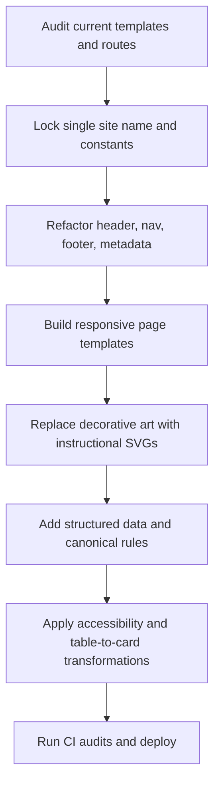
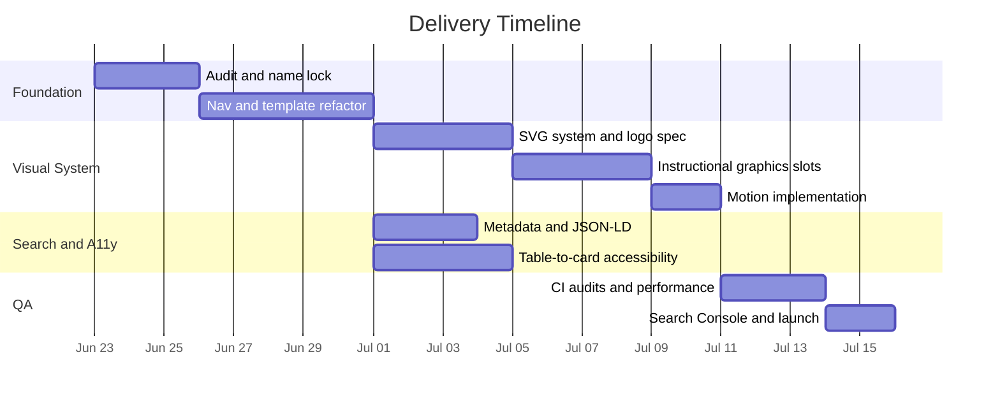
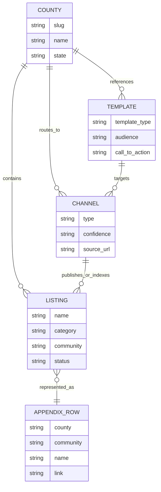

# Developer Implementation Plan for Wonderful Kashata

## Executive Summary

The current site already has several strong foundations: a task-oriented information architecture, explicit county segmentation, source-confidence labeling, a working skip link, and a progressive-enhancement posture where core pages and data remain usable without JavaScript. At the same time, the audit reveals three structural issues that should be fixed before visual polish: inconsistent brand naming across header, home page, and page titles; data-heavy layouts that will not scale cleanly to tablet and phone without alternate render patterns; and graphics that should function as route diagrams rather than decorative art. The home page mixes “Stateline Guide” and “Tri-County Regional Marketing Guide,” while secondary pages are titled as “... | Stateline Guide.” The site also exposes the appendix as a 456-row contact table and still includes placeholder intake details on submission flows. citeturn0view0turn1view0turn1view1turn1view2turn2view0

The implementation recommendation is to treat this as a structured refactor rather than a visual reskin. The first release should unify site naming and metadata, normalize navigation, and establish responsive page templates for desktop, tablet, and mobile. The second release should replace decorative graphics with accessible SVG infographics tied to page tasks. The third release should harden SEO, accessibility, and structured data, then ship performance budgets and automated auditing into CI. This sequencing matches Google’s guidance to keep site names consistent and make the page’s main title clear, while preserving the site’s current “works without JS” baseline. citeturn16search1turn6search0turn0view0

The single recommended site name is **Stateline Tri-County Guide**. It is shorter and more ownable than the current long-form home-page title, but still preserves the site’s two strongest geographic signals: “Stateline” for cross-state context and “Tri-County” for the core service area. Search-volume data and current query data were not provided, so this recommendation is based on information scent, geographic clarity, and Google’s guidance to avoid overly generic site names and use the preferred site name consistently across structured data, titles, and visible on-page text. Validate the final decision with Search Console query data and Google Trends before locking it into production. citeturn16search1turn15search0turn15search4

## Current Audit Findings

The site is already organized around tasks rather than around a generic brochure structure. The top-level navigation groups content into “Find,” “Counties,” and “Use,” with key routes including Plan, Network, Amplify, Post, Region, county pages, Templates, Submit, Appendix, and About. The home page explicitly states that search, filters, and copy buttons require JavaScript, but that pages, tables, links, downloads, and appendix content still work without it. That is a strong implementation baseline and should be preserved for all new navigation, card layouts, motion, and illustration enhancements. citeturn0view0

The site’s core content model is also clear. The home page describes the guide as a routing layer for businesses, nonprofits, artists, venues, programs, services, and mentorships across Colfax, Las Animas, and Huerfano counties. The Plan page formalizes a six-step cycle: name the job, choose the audience, start with directories, prepare one packet, test matched channels, and track and repeat. County pages then prioritize high-confidence official/public sources before looser outreach leads, while the appendix exposes a downloadable CSV, JSON, and sources list for the full inventory. citeturn0view0turn1view0turn2view0turn2view4turn2view5

The most urgent content and branding problem is inconsistency. On the home page, the header reads “SG Stateline Guide,” while the main visible title reads “Tri-County Regional Marketing Guide.” Secondary pages such as Plan, Templates, Submit, Appendix, County, and About use “... | Stateline Guide” as the page title. Google’s site-name system explicitly considers `WebSite` structured data, `og:site_name`, the `<title>`, headings, and other home-page text; Google also recommends keeping the site name consistent across those sources and avoiding generic names. That means this inconsistency is not only a UX issue, but also an SEO implementation issue. citeturn0view0turn1view0turn1view1turn1view2turn1view3turn1view4turn1view5turn16search1

The second urgent issue is mobile handling of dense data. The appendix is explicitly a 456-entry contact table with columns for county, community, name, category, type, access, status, phone, email, address, link, and notes. WCAG reflow guidance requires that content remain usable at a width equivalent to 320 CSS pixels without two-dimensional scrolling, except where two-dimensional layout is essential. For this site, the full table may remain available on large screens and in downloadable files, but the primary small-screen pattern should be card-based, with the table preserved as an advanced desktop view. citeturn2view0turn17search0turn17search2

The third urgent issue is unfinished operational content. The Submit page still shows placeholder manual intake values, visible placeholder email and phone information, and a visible “Do not fill this out” honeypot-like field block in the reading flow. That is acceptable in staging, but not acceptable for a public indexed launch. Replace placeholder routing before any SEO expansion or CTA promotion. citeturn1view2

## Prioritized Implementation Methodology

The plan below is intended for direct implementation by a front-end developer or Codex-style coding agent. The order matters: fix identity and architecture first, then graphics and motion, then metadata and accessibility hardening, then testing and deployment.



### Stepwise build order

1. **Create site-wide constants and content maps.** Add a single source of truth for site identity and metadata. At minimum define `SITE_NAME`, `SITE_NAME_ALT`, `SITE_TAGLINE`, `SITE_REGION`, `COUNTIES`, `PAGE_TYPE`, and `DEFAULT_OG_IMAGE`. This prevents the current home-page/header/title mismatch from recurring. Google recommends consistent use of the chosen site name across the home page and structured data. citeturn0view0turn16search1

2. **Freeze responsive breakpoints and page templates before redesign.** Use one desktop template family, one tablet adaptation family, and one mobile-first card family. Suggested breakpoints: `>= 1200px` desktop, `768px–1199px` tablet, `<= 767px` mobile. The specific breakpoint values are implementation choices, but the requirement is to satisfy readable reflow and logical sequence at small widths. citeturn17search0turn17search1turn10search2

3. **Unify navigation and source order.** Preserve the current IA categories because they are already meaningful: task pages, county pages, templates/resources, appendix/about. Rebuild the header so the source order matches the visual order, with the skip link first, then utility nav, then primary nav, then page heading. WCAG focus-order guidance requires that focus move in an order that preserves meaning. citeturn0view0turn10search1turn10search2

4. **Refactor the home page into three explicit entry paths.** Implement the hero as a task router, not a billboard. Keep three top-level actions: Plan, Find Network, Understand Region. Retain the role-based quick starts below. This follows the current site language and prevents the home page from becoming a generic marketing page. citeturn0view0turn1view0

5. **Create device-specific render rules.**  
   - Desktop: show table views, multi-column route diagrams, download affordances, and full appendix.  
   - Tablet: keep two-column layouts, filtered tables, diagram-plus-explanation modules, and sticky section nav.  
   - Mobile: hide wide tables by default, expose card lists and accordion details, and front-load “what to do next” actions.  
   This is necessary to preserve usability and reflow at 320 CSS pixels. citeturn2view0turn17search0turn17search2

6. **Convert graphics into instructional components.** Every new visual must answer one question: “where do I start,” “what route fits this job,” “which county hub matters,” or “what happens next.” Tie each graphic to the current cycle and county routing model already present in the content. Remove any hero/banner art that cannot be summarized in one sentence of user-facing purpose. citeturn1view0turn2view4turn2view6

7. **Implement new site naming everywhere at once.** Update the header brand text, home-page hero title, footer, logo alt text, `<title>` templates, `og:site_name`, `twitter:title`, and `WebSite` structured data in one release. Google says title links may use page titles, headings, and other prominent text, so site identity should not conflict with itself. citeturn6search0turn16search1

8. **Ship metadata, structured data, sitemap, and canonical rules.** Implement self-referencing canonicals in initial HTML, not only in JavaScript. The homepage should add `WebSite` and `Organization`; county pages should add `BreadcrumbList` and semantic page/collection markup; the appendix should add dataset markup only if the download files remain public and accurately described on-page. Google says structured data must describe visible page content and that HTML canonicals are preferred over JavaScript-only changes. citeturn16search0turn7search2turn8search0turn7search0turn6search6turn6search15

9. **Apply accessibility and content conversion rules.** Preserve the skip link, ensure all controls are keyboard reachable, label icon-only actions, write alt text only where the image conveys meaning, and render mobile cards from the same data source as desktop tables so information and sequence remain equivalent. citeturn10search0turn10search1turn10search2turn10search11turn17search1

10. **Run CI-backed audits before deploy.** Use Lighthouse, accessibility checks, structured-data validation, SVG optimization, and link validation on every build. Then submit the sitemap in Search Console and monitor the Performance and Core Web Vitals reports after launch. Lighthouse audits performance, accessibility, and SEO; Search Console exposes query performance and CWV status. citeturn18search0turn18search3turn18search9turn15search0turn9search6

### Implementation acceptance criteria

A release is ready only when all of the following are true:

- Every page uses the same `SITE_NAME` constant in visible chrome and metadata. citeturn16search1
- Tablet and mobile layouts reflow without horizontal scrolling for ordinary content. citeturn17search2
- All non-decorative SVGs have accessible names; decorative SVGs are hidden from assistive tech. citeturn13search3turn13search13
- Motion respects `prefers-reduced-motion`. citeturn5search2turn5search5
- Placeholder intake data is removed from public pages. citeturn1view2

## Naming, Navigation, and Instructional Graphics

### Naming decision process and recommendation

Because search-volume data, Search Console data, and Analytics data were not supplied, the naming recommendation cannot be based on actual impression or CTR performance yet. The correct validation workflow is: export existing query impressions and CTR from Search Console, compare candidate terms in Google Trends by region and time window, then manually review branded and non-branded SERPs for the counties and nearby cities. Search Console’s Performance report shows which queries drive impressions and clicks, and Google Trends is the official tool for comparing relative interest over time and by geography. citeturn15search0turn15search3turn15search4

Use four naming criteria:

1. **Consistency**: one string for the site name, one alternative name only if needed. Google explicitly recommends consistency across structured data and other home-page signals. citeturn16search1  
2. **Distinctiveness**: avoid a fully generic phrase like “Regional Marketing Guide.” Google warns generic names are less likely to be selected as the site name. citeturn16search1  
3. **Geo-recognition**: include the cross-state and tri-county context somewhere in the primary or alternative name because the site serves Colfax, Las Animas, and Huerfano counties. citeturn0view0turn2view6  
4. **Intent fit**: reserve page titles and H1s for the high-intent searchable nouns such as directory, events, county, templates, posting, and appendix. Google’s title-link guidance emphasizes clear main titles. citeturn6search0

**Recommended single site name:** **Stateline Tri-County Guide**. This is the best compromise between the current visible brand fragments (“Stateline Guide” and “Tri-County Regional Marketing Guide”), geographic specificity, and memorability. It is shorter than the current home-page title, less generic than “Regional Marketing Guide,” and more distinctive than “Tri-County Guide” alone. It should be paired with this alternative name in structured data: `Tri-County Regional Marketing Guide`. citeturn0view0turn16search1

**Recommended taglines:**

- Routes to listings, calendars, media, and partners across three counties.
- Find the right local channel before you build a contact list.
- A practical visibility guide for business, arts, events, and nonprofits.

### Target queries and modifiers

Because current query data is unspecified, use intent buckets rather than fake volumes. The site should target these classes of queries through page titles and headings, not by stuffing the site name:

- **Regional route intent**: `tri county business guide`, `tri county marketing guide`, `regional visibility guide`, `stateline business resources`
- **County modifiers**: `Colfax County NM business resources`, `Las Animas County CO business directory`, `Huerfano County CO events`, `Trinidad CO economic development`, `Raton NM business licenses`, `La Veta business directory`
- **Task intent**: `event submission templates`, `directory listing request template`, `where to post local event`, `community calendar submission`, `nonprofit referral directory`
- **Data intent**: `county contact appendix`, `local directory csv`, `regional business resource list`

These terms are inferred from the site’s actual page purposes, county scope, and linked official/public resources; they require validation in Search Console and Google Trends before they should influence final title wording. citeturn0view0turn1view0turn1view1turn2view4turn2view5turn15search0turn15search4

### Navigation implementation rules

Normalize the primary nav into one stable order and keep the same DOM order across breakpoints:

```html
<a class="skip-link" href="#main">Skip to content</a>

<header class="site-header">
  <a class="site-brand" href="/" aria-label="Stateline Tri-County Guide home">
    
  </a>

  <button
    class="nav-toggle"
    aria-expanded="false"
    aria-controls="primary-nav"
    aria-label="Open primary navigation">
    <svg aria-hidden="true" focusable="false" width="24" height="24"></svg>
  </button>

  <nav id="primary-nav" aria-label="Primary">
    <ul>
      <li><a href="/plan/">Plan</a></li>
      <li><a href="/network/">Find</a></li>
      <li><a href="/amplify/">Amplify</a></li>
      <li><a href="/post/">Post</a></li>
      <li><a href="/region/">Region</a></li>
      <li><a href="/counties/colfax/">Colfax</a></li>
      <li><a href="/counties/las-animas/">Las Animas</a></li>
      <li><a href="/counties/huerfano/">Huerfano</a></li>
      <li><a href="/templates/">Templates</a></li>
      <li><a href="/submit/">Submit</a></li>
      <li><a href="/appendix/">Appendix</a></li>
      <li><a href="/about/">About</a></li>
    </ul>
  </nav>
</header>

<main id="main">
  ...
</main>
```

Use a real skip link first in source order, real button semantics for the mobile menu toggle, and `aria-expanded` state changes. Visible labels remain preferable to `aria-label`; use `aria-label` only where the control has no visible text. citeturn10search1turn10search11turn10search3

### Graphics-as-instruction system

Instead of one art style per page, implement one **instructional graphic family** with predictable roles:

- **Hero route diagram** on Home and Plan: “Choose job → audience → directories → packet → channels → track.”
- **County hub banner** on county pages: show the first official/public hubs and then secondary outreach leads.
- **Channel matrix graphic** on Network/Amplify/Post: map listing, media, calendars, partners, and funding/support paths.
- **Appendix diagram** on large screens only: explain how confidence labels and source types work before the full table.

This direction fits the current site’s role as a “routing layer” and aligns graphics to the existing plan cycle and county hub logic. citeturn1view0turn2view4turn2view6

## SVG, Animation, and Logo Production Specs

### SVG infographic specification

MDN defines `viewBox` as the logical coordinate system for SVG and recommends `role="img"` plus `<title>` and `<desc>` for informative inline SVG. Use that pattern for all instructional infographics. For decorative SVGs, hide them from assistive technologies with `aria-hidden="true"`. citeturn5search1turn13search1turn13search3turn13search13

#### File naming and folder structure

Use a deterministic, machine-friendly layout:

| Path | Purpose | Naming rule |
|---|---|---|
| `src/assets/logos/` | logo source and exports | `logo-{variant}.svg` |
| `src/assets/svg/hero/` | home/plan hero diagrams | `hero-{page}-{theme}.svg` |
| `src/assets/svg/banners/` | county and section banners | `banner-{page}-{county}.svg` |
| `src/assets/svg/icons/` | nav/tab/utility icons | `icon-{name}-24.svg` |
| `src/assets/svg/infographics/` | reusable diagrams | `info-{topic}-{ratio}.svg` |
| `src/assets/og/` | OG/social images generated from SVG or HTML | `og-{page-type}.png` |
| `src/data/` | structured data and listing JSON | `{entity-type}.json` |
| `src/lib/seo/` | title/meta/schema utilities | `seo.{ts|js}` |

Recommended master `viewBox` sizes:

| Asset type | Master size | Notes |
|---|---:|---|
| Hero diagram | `0 0 1440 640` | wide desktop crop, scales well |
| Section banner | `0 0 1440 240` | compact instructional strip |
| County hub graphic | `0 0 1200 720` | flexible for desktop/tablet |
| Infographic card | `0 0 960 720` | exportable and printable |
| Tab icon | `0 0 24 24` | align to text baseline |
| Logo horizontal | `0 0 512 128` | primary lockup |
| Logo stacked/mark | `0 0 256 256` | mobile, favicon source |

These proposed dimensions are implementation standards, not currently observed site behavior. They are chosen to align with SVG scaling via `viewBox` and responsive rendering. citeturn5search1turn13search3

#### Accessible SVG boilerplate

```html
<svg
  class="hero-diagram"
  viewBox="0 0 1440 640"
  role="img"
  aria-labelledby="heroTitle heroDesc"
  xmlns="http://www.w3.org/2000/svg">
  <title id="heroTitle">Regional growth route diagram</title>
  <desc id="heroDesc">
    A six-step route showing goal selection, audience selection, directories,
    packet preparation, matched channels, and tracking.
  </desc>

  <g class="node node-goal">...</g>
  <g class="node node-audience">...</g>
  <g class="route-lines">...</g>
</svg>
```

Use `role="img"` for self-contained informative illustrations. If the same meaning is already present in adjacent visible text and the SVG is decorative, use `aria-hidden="true" focusable="false"` instead. citeturn13search3turn13search13

### Animation approach

Use this default hierarchy:

1. **CSS** for repeated, non-stateful motion such as fades, gentle translations, pulse highlights, and tab underline transitions.
2. **JavaScript** only for stateful motion tied to user actions, scroll position, or route changes, and drive it with `requestAnimationFrame` when frame-by-frame updates are needed.
3. **SMIL** only for isolated self-contained SVG micro-illustrations that do not need interactivity, shared tokens, or JS state hooks. Avoid SMIL for nav, hero, and tab interactions.

The reason for this order is practical and performance-driven: web.dev recommends `transform` and `opacity` where possible because they stay on the compositing stage, and MDN notes that `requestAnimationFrame()` aligns animation work to the display refresh cycle and is paused in background tabs. Motion should also respect `prefers-reduced-motion`. citeturn14search0turn14search3turn5search2turn5search5

#### Hero animation example

```html
<section class="hero hero--route">
  <div class="hero-copy">
    <h1>Stateline Tri-County Guide</h1>
    <p>Choose the route before you collect links.</p>
  </div>

  <svg
    class="hero-art"
    viewBox="0 0 1440 640"
    aria-hidden="true"
    focusable="false"
    xmlns="http://www.w3.org/2000/svg">
    <g class="route-line">...</g>
    <g class="route-node route-node--1">...</g>
    <g class="route-node route-node--2">...</g>
  </svg>
</section>
```

```css
.hero-art .route-line {
  transform-origin: center;
  animation: heroFloat 8s ease-in-out infinite;
}

.hero-art .route-node {
  animation: heroPulse 4s ease-in-out infinite;
}

.hero-art .route-node--2 {
  animation-delay: 1.2s;
}

@keyframes heroFloat {
  0%, 100% { transform: translateY(0); opacity: 1; }
  50% { transform: translateY(-8px); opacity: 0.92; }
}

@keyframes heroPulse {
  0%, 100% { transform: scale(1); }
  50% { transform: scale(1.03); }
}

@media (prefers-reduced-motion: reduce) {
  .hero-art .route-line,
  .hero-art .route-node {
    animation: none;
    transform: none;
  }
}
```

This uses only `transform` and `opacity`, which are the preferred properties for performant animation. citeturn14search0turn14search20turn5search2

#### Banner animation example

Use banners for slight “route activation” feedback, not parallax.

```css
.banner-graphic [data-highlight="true"] {
  transition: transform 160ms ease, opacity 160ms ease;
}

.banner:hover .banner-graphic [data-highlight="true"],
.banner:focus-within .banner-graphic [data-highlight="true"] {
  transform: translateY(-2px);
  opacity: 1;
}

@media (prefers-reduced-motion: reduce) {
  .banner-graphic [data-highlight="true"] {
    transition: none;
  }
}
```

### Tab bar motion and icon system

Use CSS for the indicator animation and JS only to synchronize active state and `aria-selected`. Keep icons decorative if adjacent text labels exist.

```html
<div class="tab-bar" role="tablist" aria-label="Guide sections">
  <button role="tab" aria-selected="true" aria-controls="panel-plan" id="tab-plan">
    <svg aria-hidden="true" focusable="false" viewBox="0 0 24 24"></svg>
    <span>Plan</span>
  </button>
  <button role="tab" aria-selected="false" aria-controls="panel-find" id="tab-find">
    <svg aria-hidden="true" focusable="false" viewBox="0 0 24 24"></svg>
    <span>Find</span>
  </button>
  <span class="tab-indicator" aria-hidden="true"></span>
</div>
```

```css
.tab-bar {
  position: relative;
}

.tab-indicator {
  position: absolute;
  bottom: 0;
  height: 2px;
  width: var(--indicator-width, 0);
  transform: translateX(var(--indicator-x, 0));
  transition: transform 180ms ease, width 180ms ease;
}
```

```js
const tabBar = document.querySelector('.tab-bar');
const tabs = [...tabBar.querySelectorAll('[role="tab"]')];
const indicator = tabBar.querySelector('.tab-indicator');

function moveIndicator(tab) {
  const { offsetLeft, offsetWidth } = tab;
  indicator.style.setProperty('--indicator-x', `${offsetLeft}px`);
  indicator.style.setProperty('--indicator-width', `${offsetWidth}px`);
}

tabs.forEach((tab) => {
  tab.addEventListener('click', () => {
    tabs.forEach((t) => t.setAttribute('aria-selected', String(t === tab)));
    moveIndicator(tab);
  });
});

moveIndicator(tabs.find((t) => t.getAttribute('aria-selected') === 'true'));
```

### SVG performance rules

Optimize all SVGs before commit. Favor simple paths, reuse symbols, avoid heavy filters and masks unless required, and keep motion on transform/opacity only. Use an optimizer such as SVGO or the SVGOMG interface, and serve compressed SVG assets. SVGOMG is explicitly an SVG optimizer/minifier based on SVGO. citeturn14search0turn13search4

Recommended SVG budgets:

- logo: `<= 12 KB` optimized
- tab icon: `<= 2 KB`
- banner: `<= 20 KB`
- hero infographic: `<= 60 KB`
- no inline SVG should exceed `300` DOM nodes without strong reason

These numbers are implementation budgets, not standards; they are chosen to keep the SVG layer maintainable and fast.

### Logo production methodology

The logo should be built as an SVG-first system, not as a raster artifact. Produce these variants in this order:

1. **Wordmark sketch pass** using the chosen site name: `Stateline Tri-County Guide`
2. **Symbol pass** using one simple geometric metaphor, preferably route-node + county-link abstraction rather than map literalism
3. **Horizontal lockup**
4. **Stacked lockup**
5. **Mark-only**
6. **Monochrome and single-color versions**
7. **Favicon/app icon extraction**

Keep text as text only while iterating; convert to outlines only for final export if font licensing or rendering consistency requires it.

#### Logo design tokens

```css
:root {
  --color-ink: #14202b;
  --color-paper: #ffffff;
  --color-accent: #0f6a6a;
  --color-accent-2: #7a4b22;
  --color-muted: #5c6b78;
  --color-border: #d6dde3;
  --focus-ring: #0b57d0;
}
```

For UI usage around the logo, normal text should meet WCAG AA contrast of at least 4.5:1, and meaningful non-text graphical objects should meet 3:1 against adjacent colors. WCAG also notes that text that is part of a logo or brand name is exempt from the text contrast requirement, but in practice the linked header logo should still be designed for legibility against its background. citeturn12search4turn11search10turn11search1

#### Logo production steps

1. Define clear-space and minimum size rules.
2. Test horizontal lockup in header at `24px`, `32px`, and `40px` cap heights.
3. Test mark-only version at `16px`, `24px`, `32px`, and `48px`.
4. Verify contrast on light and dark header backgrounds.
5. Export:
   - `logo-horizontal.svg`
   - `logo-stacked.svg`
   - `logo-mark.svg`
   - `logo-mono-dark.svg`
   - `logo-mono-light.svg`
   - `favicon-32.png`
   - `favicon-48.png`
   - `apple-touch-icon-180.png`
   - `android-chrome-192.png`
   - `android-chrome-512.png`

## Metadata, Structured Data, and SEO Operations

### Metadata priorities

Google’s guidance is straightforward: make main titles clear; write useful meta descriptions; use canonical URLs to signal the preferred version of duplicate or similar pages; build a sitemap; and use robots controls carefully. Google also explicitly says the `keywords` meta tag has no effect on Google Search ranking, so do not spend time implementing it. citeturn6search0turn6search1turn6search2turn6search3turn6search7turn6search17

Ship metadata in this order:

1. Self-referencing canonical on every indexable page
2. Consistent `<title>` templates by page type
3. Consistent meta description templates by page type
4. Open Graph and Twitter card defaults
5. `WebSite` + `Organization` JSON-LD on home
6. `BreadcrumbList` JSON-LD on all deeper pages
7. `Dataset` JSON-LD on appendix only if the on-page downloadable dataset remains public and described accurately
8. XML sitemap and robots.txt with sitemap declaration
9. Search Console submission and post-launch monitoring

If the site remains English-only at one URL set, do **not** add `hreflang` yet. Google says `hreflang` is for localized variations of the same content across alternate URLs and is not how Google detects page language. Add it only when parallel language or region URLs exist. citeturn9search0turn9search2

### Metadata templates by page type

| Page type | Meta title template | Meta description template | Canonical pattern |
|---|---|---|---|
| Home | `Stateline Tri-County Guide | Regional visibility routes for Colfax, Las Animas, and Huerfano` | `Find listings, calendars, media, partners, and verified public-resource routes across Colfax County NM, Las Animas County CO, and Huerfano County CO.` | `/` |
| County | `{County} County Guide | Stateline Tri-County Guide` | `Official resources, directory shortcuts, media, and outreach leads for {County} County, with verification notes and next actions.` | `/counties/{slug}/` |
| Templates | `Outreach Templates | Stateline Tri-County Guide` | `Copy-ready templates for directory requests, event submissions, media pitches, partner outreach, and follow-up tracking.` | `/templates/` |
| Appendix | `Contact Appendix | Stateline Tri-County Guide` | `Browse and download the tri-county contact appendix with grouped county resources, confidence labels, and source links.` | `/appendix/` |
| Post/Amplify/Network | `{Page Name} | Stateline Tri-County Guide` | `{Purpose sentence}. Includes local channels, verification guidance, and next-action routing.` | `/{slug}/` |

Use sentence-case titles, keep the front-loaded query target before the brand when possible, and keep page titles aligned with visible H1s. That follows Google’s title-link preference for a clear main title and aligned visible signals. citeturn6search0

### Head implementation example

```html
<title>Colfax County Guide | Stateline Tri-County Guide</title>
<meta
  name="description"
  content="Official resources, directory shortcuts, media, and outreach leads for Colfax County, with verification notes and next actions." />
<link rel="canonical" href="https://wonderful-kashata-6ed008.netlify.app/counties/colfax/" />

<meta property="og:type" content="website" />
<meta property="og:site_name" content="Stateline Tri-County Guide" />
<meta property="og:title" content="Colfax County Guide | Stateline Tri-County Guide" />
<meta
  property="og:description"
  content="Official resources, directory shortcuts, media, and outreach leads for Colfax County, with verification notes and next actions." />
<meta property="og:url" content="https://wonderful-kashata-6ed008.netlify.app/counties/colfax/" />
<meta property="og:image" content="https://wonderful-kashata-6ed008.netlify.app/assets/og/og-county.png" />

<meta name="twitter:card" content="summary_large_image" />
<meta name="twitter:title" content="Colfax County Guide | Stateline Tri-County Guide" />
<meta
  name="twitter:description"
  content="Official resources, directory shortcuts, media, and outreach leads for Colfax County, with verification notes and next actions." />
<meta name="twitter:image" content="https://wonderful-kashata-6ed008.netlify.app/assets/og/og-county.png" />
```

### Structured data types to include

Use only markup supported by the visible page content. Google explicitly warns not to add structured data for content that is not visible on the page. citeturn16search0

**Implement now:**

- `WebSite` on home for site name preference
- `Organization` on home/about if the organization identity is real and public
- `BreadcrumbList` on all deeper pages
- `Dataset` on the appendix only if the downloadable CSV/JSON/source materials remain publicly available and properly described
- generic semantic `CollectionPage` / `ItemList` markup as supplemental schema.org on county, appendix, and network pages if useful for machine interpretation

**Implement later, only if the content model exists:**

- `Event` for individual event detail pages
- `LocalBusiness` only for actual business entity pages owned by the site, not for directory mentions of third parties

Google supports Organization, Breadcrumb, Dataset, Event, and Local Business rich-result families in its search gallery; `CollectionPage` is a schema.org type useful for semantics even if not a Google-rich-result type. citeturn7search0turn7search2turn7search7turn8search0turn7search1

#### `WebSite` + `Organization` JSON-LD example

```html
<script type="application/ld+json">
{
  "@context": "https://schema.org",
  "@graph": [
    {
      "@type": "WebSite",
      "@id": "https://wonderful-kashata-6ed008.netlify.app/#website",
      "url": "https://wonderful-kashata-6ed008.netlify.app/",
      "name": "Stateline Tri-County Guide",
      "alternateName": "Tri-County Regional Marketing Guide",
      "inLanguage": "en-US"
    },
    {
      "@type": "Organization",
      "@id": "https://wonderful-kashata-6ed008.netlify.app/#organization",
      "name": "Stateline Tri-County Guide",
      "url": "https://wonderful-kashata-6ed008.netlify.app/",
      "logo": "https://wonderful-kashata-6ed008.netlify.app/assets/logos/logo-mark.svg"
    }
  ]
}
</script>
```

#### `BreadcrumbList` JSON-LD example

```html
<script type="application/ld+json">
{
  "@context": "https://schema.org",
  "@type": "BreadcrumbList",
  "itemListElement": [
    {
      "@type": "ListItem",
      "position": 1,
      "name": "Home",
      "item": "https://wonderful-kashata-6ed008.netlify.app/"
    },
    {
      "@type": "ListItem",
      "position": 2,
      "name": "Counties",
      "item": "https://wonderful-kashata-6ed008.netlify.app/counties/"
    },
    {
      "@type": "ListItem",
      "position": 3,
      "name": "Colfax",
      "item": "https://wonderful-kashata-6ed008.netlify.app/counties/colfax/"
    }
  ]
}
</script>
```

#### `Dataset` JSON-LD example for appendix

```html
<script type="application/ld+json">
{
  "@context": "https://schema.org",
  "@type": "Dataset",
  "name": "Tri-County Public Contact Appendix",
  "description": "Grouped county and regional resource listings with source links, confidence labels, and public contact information.",
  "url": "https://wonderful-kashata-6ed008.netlify.app/appendix/",
  "inLanguage": "en-US",
  "distribution": [
    {
      "@type": "DataDownload",
      "encodingFormat": "text/csv",
      "contentUrl": "https://wonderful-kashata-6ed008.netlify.app/downloads/appendix.csv"
    },
    {
      "@type": "DataDownload",
      "encodingFormat": "application/json",
      "contentUrl": "https://wonderful-kashata-6ed008.netlify.app/downloads/appendix.json"
    }
  ]
}
</script>
```

### Robots and sitemap

`robots.txt` should allow normal crawling, declare the sitemap, and avoid pretending to secure private content. Google states that robots.txt primarily manages crawler traffic and does not secure sensitive information. citeturn6search7turn6search18

```txt
User-agent: *
Allow: /

Sitemap: https://wonderful-kashata-6ed008.netlify.app/sitemap.xml
```

Generate an XML sitemap from the route manifest and include lastmod dates from content build timestamps. Then submit the sitemap in Search Console. Google says sitemaps help search engines crawl the site more efficiently and can list alternate language versions if those ever exist. citeturn6search3turn6search11

## Accessibility, Content Conversion, and Responsive Data Patterns

### Alt text, ARIA, and text-to-speech phrasing rules

All images need an alternative text strategy. Decorative images should have empty alt text or be hidden if they are inline SVG; images that convey information should have concise, equivalent text. WAI recommends CSS backgrounds for purely decorative images where possible, and meaningful labels for controls and form fields. citeturn10search0turn10search11turn10search4

Apply these authoring rules:

- Do **not** start alt text with “image of,” “graphic of,” or file-like descriptions.
- Start with the meaning, not the medium.
- Keep to one sentence unless a longer structured description is necessary in adjacent text or `<desc>`.
- For instructional SVGs, write alt/TTS phrasing as: **object + purpose + salient structure**.  
  Example: “County route diagram showing official hubs first and outreach leads second.”
- For icon-only buttons, use verb-first labels.  
  Example: `aria-label="Open county navigation"` or `aria-label="Copy directory request template"`.

Use `aria-label` only when there is no visible label; otherwise prefer visible text or `aria-labelledby`. citeturn10search3turn10search11

#### Example: icon button and section label

```html
<button
  type="button"
  class="copy-button"
  aria-label="Copy directory listing request template">
  <svg aria-hidden="true" focusable="false" viewBox="0 0 24 24"></svg>
</button>

<section aria-labelledby="countyHubHeading">
  <h2 id="countyHubHeading">Colfax County hub route</h2>
  ...
</section>
```

### WCAG 2.1 AA checks to enforce

Use WCAG 2.1 AA as the baseline because the user explicitly requested that standard. Enforce these checks in design review and QA:

- **1.4.3 Contrast (Minimum):** normal text `>= 4.5:1`, large text `>= 3:1` citeturn12search4
- **1.4.11 Non-text Contrast:** meaningful UI and graphical objects `>= 3:1` citeturn11search10turn11search1
- **1.4.10 Reflow:** no horizontal scrolling for ordinary content at `320 CSS px` citeturn17search2
- **1.3.2 Meaningful Sequence:** DOM reading order must preserve meaning as layouts collapse citeturn17search1turn17search7
- **2.4.3 Focus Order:** tab order must match intended flow citeturn10search2
- **2.4.1 Bypass Blocks:** keep the skip link functional and first in focus order citeturn10search1

### Keyboard focus order and skip links

The site already includes a skip link. Preserve it and make sure it remains the first focusable element on all templates. Focus order should follow the visual and semantic order of the page: skip link, header brand, primary nav, page-local nav if present, main content, aside, footer. Avoid positive `tabindex` values; let DOM order determine focus order. citeturn0view0turn10search1turn10search2turn10search18

#### Skip link example

```css
.skip-link {
  position: absolute;
  left: 1rem;
  top: 0;
  transform: translateY(-200%);
}

.skip-link:focus {
  transform: translateY(0);
}
```

### Mapping tables to mobile cards

For accessibility and SEO, do **not** destroy the data model. Render desktop tables and mobile cards from the same underlying content source. This preserves meaningful sequence and content parity. The appendix’s wide table is valuable on desktop, but on small screens the default experience should be cards with expandable secondary fields. citeturn2view0turn17search1turn17search2

Recommended field mapping for table row → mobile card:

- **Card title:** `Name`
- **Eyebrow:** `County · Community`
- **Primary facts:** `Category`, `Type`, `Status`
- **Action line:** `Reader action` or `Use`
- **Secondary details:** phone, email, address, verification notes
- **CTA:** source link or “Open”

#### Card-render pattern example

```html
<article class="resource-card" aria-labelledby="resource-rrbd-title">
  <p class="resource-card__eyebrow">Colfax · Red River</p>
  <h3 id="resource-rrbd-title">Red River Brewing Company &amp; Distillery</h3>

  <dl class="resource-card__facts">
    <div>
      <dt>Category</dt>
      <dd>Food &amp; beverage</dd>
    </div>
    <div>
      <dt>Type</dt>
      <dd>Promotion</dd>
    </div>
    <div>
      <dt>Status</dt>
      <dd>Source-linked lead · Medium confidence</dd>
    </div>
  </dl>

  <p class="resource-card__notes">
    Use as a launch or outreach lead; verify details before spending money,
    printing materials, or promising eligibility.
  </p>

  <p class="resource-card__actions">
    <a href="https://redriverbrewing.com">Open source</a>
  </p>
</article>
```

Keep the same content available in the desktop table and downloadable files. Use cards as the default mobile presentation, not a different editorial summary.

## Testing, Deployment, and Workplan

### CI and audit checklist

Lighthouse is the right baseline for automated quality checks because it covers performance, accessibility, SEO, and other quality dimensions. Core Web Vitals should then be monitored with real-user data in Search Console after launch. Good CWV thresholds remain LCP `<= 2.5s`, INP `<= 200ms`, and CLS `<= 0.1` at the 75th percentile. citeturn18search0turn18search1turn18search3turn18search9

Use this pre-deploy checklist:

- HTML validation and broken-link scan
- Lighthouse CI on representative pages: home, one county page, templates, appendix
- axe or equivalent accessibility scan
- keyboard-only smoke test
- reduced-motion smoke test
- structured-data validation for JSON-LD
- SVG optimization check
- robots.txt and sitemap existence check
- canonical self-reference check
- social-card preview check
- no-placeholder-content check on Submit and footer
- Search Console property verified and sitemap submitted

Recommended Lighthouse score targets for the first stable release:

| Audit area | Target |
|---|---:|
| Accessibility | `>= 95` |
| SEO | `>= 95` |
| Best Practices | `>= 90` |
| Performance mobile | `>= 85` |
| Performance desktop | `>= 95` |

These are project targets, not official thresholds.

### Performance budgets and animation fallbacks

Use these initial budgets:

- critical CSS: `<= 50 KB` gzipped
- route JS before hydration/interactivity: `<= 170 KB` gzipped
- one inline SVG per page hero only; all secondary SVGs externalized
- largest single SVG asset: `<= 60 KB` optimized
- no animation should depend on layout-triggering properties for continuous motion
- reduced-motion mode must disable non-essential loops and translate parallax-like movement to instant state changes

web.dev recommends using `transform` and `opacity` for better animation performance; treat any continuous animation of layout or paint-heavy properties as a regression. citeturn14search0turn14search20

### Implementation timeline and estimated hours

Team size was unspecified, so the table below uses total effort hours rather than calendar assumptions.



| Milestone | Scope | Estimated hours |
|---|---|---:|
| Audit and naming lock | inventory routes, templates, metadata constants, final site name | 8–14 |
| Navigation refactor | header/footer/nav, router constants, skip link preservation | 12–20 |
| Responsive templates | desktop/tablet/mobile page shells and content slots | 20–32 |
| Appendix and table-to-card conversion | dual render patterns, filters, mobile cards, parity checks | 18–30 |
| SVG system | folder structure, naming, base components, optimization pipeline | 10–18 |
| Logo system | design exploration, SVG source, responsive variants, exports | 12–20 |
| Graphics-as-instruction pass | hero/banner/county/tab graphics specs and implementation hooks | 14–24 |
| Metadata and schema | titles, descriptions, canonicals, OG, JSON-LD, robots, sitemap | 10–16 |
| Accessibility hardening | alt rules, ARIA, keyboard, contrast, reduced motion | 12–20 |
| QA and deployment | Lighthouse CI, manual audits, Search Console setup | 10–16 |

### Content model relationship diagram



### Final release gate

Do not mark the redesign complete until all of the following are true:

- the visible site name, metadata site name, and structured-data site name match exactly; citeturn16search1
- the appendix is readable on mobile without default horizontal scrolling; citeturn17search2
- the submission page no longer shows placeholder intake content; citeturn1view2
- all instructional SVGs have an accessible name or are explicitly decorative; citeturn13search3turn13search13
- reduced-motion mode disables non-essential motion; citeturn5search2turn5search5
- Search Console is connected and the sitemap has been submitted; citeturn9search6turn6search3