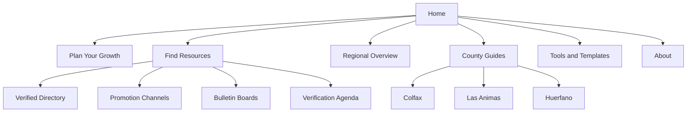
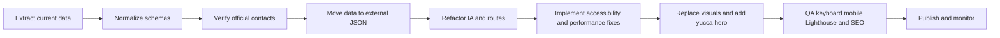

# Tri-County Guide Forensic Audit and Codex Handoff

## Executive summary

This audit found a strong underlying project intent buried under an unstable publication model. The uploaded guide artifact behaves less like a curated public resource and more like a merged working document: it contains 64 section blocks, 56 tables, 352 embedded resource records, repeated topic sections, and a large inline JSON dataset that is bundled directly into the page shell. That structure creates three visible failures at once: users cannot quickly understand where they are, they cannot reliably distinguish verified contacts from internal planning notes, and they are asked to navigate a page that keeps changing job mid-stream from guide, to appendix, to strategy memo, to verification backlog. fileciteturn0file4

The core problem is not “polish.” It is content integrity. In the embedded dataset, only 41 records are internally marked `ok`, while 305 are marked `no_url`. Many rows are not directory entities at all; they are tactics, geographic notes, hashtag suggestions, or manual-verification placeholders. Publishing those items in the same visual pattern as real organizations creates a credibility break that no amount of brand styling can fix. fileciteturn0file4

The accessibility and platform baseline also needs work before any aesthetic pass. The uploaded HTML lacks a `main` landmark, a skip link, a `noscript` fallback, and table captions; 63 of 64 sections have no explicit accessible region label. WCAG 2.1 AA requires sufficient contrast for normal text and a visible focus indicator for keyboard-operable controls, and WAI’s landmark guidance is clear that meaningful landmark regions materially improve structural navigation for assistive technology users. fileciteturn0file4 citeturn6view0turn7view0turn7view1

The fix path is clear. First, split the data model into public directory entries, promotion channels, research facts, and internal verification agenda items. Second, collapse the information architecture into task-based routes. Third, add the accessibility floor and pull the embedded resource JSON out of the page shell. Only after those steps should Codex apply brand refinements, motion treatments, and figure placement. fileciteturn0file4

## Scope and evidence

This audit used the uploaded interactive HTML guide as the primary implementation artifact, because the live Netlify route graph behind `https://wonderful-kashata-6ed008.netlify.app/` was not crawlable from the current research environment. Live areas that could not be fetched are therefore marked as unspecified rather than guessed. The review also used the uploaded Super Eukarya brand assets and a selected set of official municipal, county, tourism, and organization websites to verify representative listings and contact data. fileciteturn0file4 citeturn10view0turn12view0turn11view0turn11view3turn12view1turn15view1turn19view0turn17view0turn11view4turn14view0turn20view0

The uploaded artifact is heavy because it inlines almost everything. The HTML is roughly 739 KB uncompressed, compresses to about 125 KB with gzip, contains 3,781 element nodes, and includes an inline JSON blob of about 488 KB. That is not catastrophic for delivery once compressed, but it is the wrong maintenance shape for a directory project because every data change requires touching the main page shell and every first render must carry both presentation and dataset together. fileciteturn0file4

The standards side of this audit is grounded in primary documentation. W3C’s WCAG 2.1 understanding documents set the Level AA normal-text contrast threshold at 4.5:1 and require visible focus indication for keyboard-operable UI. MDN documents `prefers-reduced-motion` as the mechanism for detecting and honoring users who request less non-essential motion. Chrome’s Lighthouse documentation shows that Largest Contentful Paint, Total Blocking Time, and Cumulative Layout Shift are heavily weighted in the performance score. Google Search Central documents both Organization structured data on the home page and sitemap support as useful ways to help Google understand a site and crawl it more efficiently. citeturn6view0turn7view0turn21view0turn22view0turn22view2turn22view3turn21view4turn24view0

## Crawl and verification inventory

The live site crawl is constrained, but the uploaded artifact is fully inspectable. The table below separates directly verified inventory from inferred historical structure.

| URL or path | Status | Verification basis | Notes |
|---|---|---|---|
| `https://wonderful-kashata-6ed008.netlify.app/` | Unspecified | User-provided live root; page graph not fetchable from current environment | Treat current live route inventory as incomplete |
| Uploaded guide HTML | Available | Parsed uploaded artifact fileciteturn0file4 | 64 sections, 56 tables, 352 embedded records |
| Historical page set | Inferred only | Existing roast themes and project context | Home, Plan, Amplifiers, Network, Posting, Region, Colfax, Las Animas, Huerfano, Templates, Appendix, About |
| Super Eukarya SVG package | Available | Uploaded asset package | Eight SVGs plus implementation notes |

The representative contact verification sample below uses official or directly controlled public sources.

| County | Organization | Verified contact details | Source |
|---|---|---|---|
| Colfax | City of Raton | 224 Savage Ave., P.O. Box 910, Raton, NM 87740; +1 575-445-9551 | Official municipal site footer. citeturn10view0 |
| Colfax | Colfax County Government | 230 North 3rd Street, Raton, NM 87740; (575) 445-9661 | Official county site footer. citeturn12view0 |
| Colfax | Raton MainStreet | 145 S 1st St, Raton, NM 87740; (575) 445-2052; `pduran@ratonmainstreet.org` | Official organization site footer. citeturn11view0 |
| Colfax | KRTN Enchanted Air Radio | 1128 State St, Raton, NM 87740; 575-445-3652 | Official radio site footer. citeturn11view3 |
| Colfax | Explore Raton | Official tourism site present; homepage contact not exposed | Official tourism homepage. citeturn12view1 |
| Colfax | Village of Eagle Nest | 151 Willow Creek Drive, POB 168, Eagle Nest, NM 87718; 575-377-2486 | Official village site footer. citeturn20view0 |
| Las Animas | City of Trinidad | 135 N. Animas Street, Trinidad, CO 81082; (719) 846-9843 | Official city site footer. citeturn15view1 |
| Las Animas | Town of Aguilar | 101 W Main St, Aguilar, CO 81020; 719-941-4360; `aguilardeputyclerk@gmail.com` | Official town site contact block. citeturn19view0 |
| Las Animas | Town of Cokedale | 1 G Elm St, Cokedale, CO 81082; 719-846-7428; `townofcokedale@gmail.com` | Official town clerk block. citeturn17view0 |
| Huerfano | Huerfano County Government | 401 Main Street, Walsenburg, CO 81089; (719) 738-3000 | Official county site footer. citeturn11view4 |
| Huerfano | Town of La Veta | 209 S. Main St., La Veta, CO 81055-0174; (719) 742-3631 | Official town contact information. citeturn14view0 |

The contact pattern itself proves the larger point: there are real, verifiable regional organizations worth surfacing. The current issue is not lack of source material. The issue is that the site is not separating fully usable public records from partial leads and internal work notes. fileciteturn0file4

## Forensic findings

The largest single failure is the mixed-purpose content model. The current artifact contains real public entities, but it also contains entries that are plainly internal or tactical, such as outreach-wave labels, hashtag guidance, county audience notes, cross-promotion examples, and verification agenda records. That means the UI is collapsing multiple schemas into a single public-facing pattern. A user scanning the directory cannot tell whether an item is a business to contact, a tactic to apply, a planning note, or a data point. That is why the guide feels like a spreadsheet in costume rather than a trustworthy directory. fileciteturn0file4

The information architecture compounds that problem. The asset repeats whole topical ranges, including funding, training, marketing, media, social, county resources, recommendations, and conclusion, which makes it hard to identify a canonical version of any content block. The historical project naming conventions called out in the roast themes also remain structurally wrong for users: “Amplifiers,” “Network,” and “Posting” describe your internal categorization logic, not the user’s task. A pressured bakery owner, chamber director, or town clerk wants to know where to list, where to advertise, what is verified, and what the next step is. They do not want to decode the author’s taxonomy. fileciteturn0file4


The accessibility baseline is incomplete. WAI’s landmark guidance says landmark regions help screen readers and keyboard users navigate a page’s structure, and WCAG 2.1 AA requires visible focus indication. The uploaded guide includes some focus styling, which is good, but it still lacks a skip link, a `main` landmark, and explicit labels for nearly every section region. On top of that, the page uses many wide appendix-style tables without captions, which makes the content harder to scan on both desktop and mobile. fileciteturn0file4 citeturn7view0turn7view1

The color system also needs stricter discipline. WCAG 2.1 AA sets a 4.5:1 contrast requirement for normal text. Using the uploaded palette values, the gold accent against the cream background works as an accent or rule, but not as small text; it computes to roughly 2.5:1, below the threshold. By contrast, cream on moss and navy on cream are comfortably readable. That means the site can preserve the Super Eukarya palette, but it must assign color by function rather than treat every brand hue as text-capable. fileciteturn0file4 citeturn6view0

Motion is another place where you should fix the policy before you ship the effect. MDN documents `prefers-reduced-motion` as the standard way to detect users who want less motion and to replace or reduce non-essential animation. That matters directly here because you want headline and CTA motion. The right implementation is not “animation on by default.” It is “animation available when appropriate, gracefully disabled when requested.” citeturn21view0turn21view1

The performance picture, even without a live Lighthouse run, is fairly predictable. Lighthouse heavily weights LCP, Total Blocking Time, and CLS. Because the uploaded guide has no external images and relatively modest inline JavaScript, the biggest risk is not media weight; it is front-loaded parsing, DOM bulk, and inline-data overhead. Moving the resource dataset out of the page shell, removing duplicate sections, and reducing DOM complexity are the safest first improvements. fileciteturn0file4 citeturn22view0turn22view2turn22view3

The SEO layer is underbuilt for a regional directory. Google’s Search Central documentation states that Organization structured data on the home page can help Google understand administrative details and disambiguate the organization in search results. Search Central also documents sitemap support as a way to help search engines crawl a site more efficiently, especially when the site is larger, newer, or more structurally complex. Given the inferred multi-page shape of the live project and the amount of county- and entity-specific content you want exposed, Codex should add Organization markup, route-specific titles and descriptions, and a sitemap as basic hygiene. citeturn21view4turn21view5turn24view0turn24view1


The Super Eukarya visual system is not the problem, but several current figures are too abstract to carry task value alone. The uploaded vector package is visually coherent and on-brand, but diagrams like route nodes, persona flow, and visibility stacks only work when they are tied to a concrete adjacent task and a plain-language caption. Otherwise they read like consulting slides rather than navigation aids. That is the roast’s “academic, not actionable” complaint translated into implementation terms. If a figure does not help a user make a decision in the next thirty seconds, it should either move, gain a concrete caption, or disappear. fileciteturn0file4

## Roast synthesis

Building on the existing roast frame, the common themes of clarity, polish, and credibility are still the right organizing lens. The clarity failure is structural: too many labels, too many section repetitions, too many content types in one surface. The polish failure is downstream of that: a page cannot feel clean while it is doing four jobs at once. The credibility failure is the most serious of the three: when incomplete leads and internal note categories are rendered like finished records, the user stops trusting the entire system, including the rows that are actually correct. fileciteturn0file4

The harsh but useful reading is this: the site is trying to present itself as a finished guide before it has finished deciding what counts as publishable truth. That is why the most important work for Codex is not a visual refresh. It is epistemic cleanup, route simplification, and public/private content separation. Once the data model is honest, the brand system can finally do real work instead of decorating uncertainty. fileciteturn0file4

## Codex-ready implementation plan

The priority table below is the shortest path to a public-grade version.

| Priority | Owner | Task | Effort | Risk |
|---|---|---|---:|---|
| P0 | Codex + Content | Split live listings from tactics, notes, and verification agenda; create separate schemas and UI surfaces | 8–12 h | Medium |
| P0 | Codex | Consolidate top-level navigation into 5–7 task-based routes | 10–16 h | Medium |
| P0 | Codex | Add skip link, `main`, visible focus states, table captions, mobile-safe table wrappers | 6–10 h | Low |
| P0 | Codex | Move embedded resource JSON into external versioned data files | 4–8 h | Low |
| P0 | Research + Content | Re-verify all public contact rows before publication; demote incomplete leads to a field-check queue | 20–40 h | High |
| P1 | Codex | Add reduced-motion rules for headline and CTA animation | 2–4 h | Low |
| P1 | Codex | Add Organization and route-level structured data plus sitemap support | 4–8 h | Low |
| P1 | Design + Codex | Reposition and caption Super Eukarya figures so each figure serves a task | 8–14 h | Medium |
| P2 | Content | Rewrite headlines and CTAs around user jobs rather than project jargon | 6–10 h | Low |
| P2 | Codex | Create reusable components for cards, tables, and verification badges | 6–12 h | Low |
| P2 | Design | Add yucca-banner hero with static fallback and compressed SVG delivery | 4–8 h | Low |

The information architecture should move toward this route model:



The implementation sequence for Codex should be equally explicit:



For SEO and discoverability, the baseline patch set should add Organization structured data on the home page and a sitemap. Google documents both as straightforward ways to help its systems understand the site’s identity and crawl structure. citeturn21view4turn24view0

For motion and CTA treatment, the yucca banner should be implemented with a hard reduced-motion safeguard. MDN’s documented pattern is the correct one: either remove the animation entirely or replace it with a low-motion alternative when the user preference requests reduction. citeturn21view0turn21view1

A minimal Codex-ready CSS pattern looks like this:

```css
.yucca { 
  transform-box: fill-box; 
  transform-origin: bottom center; 
  animation: yucca-sway 7s ease-in-out infinite; 
}

@keyframes yucca-sway {
  0%, 100% { transform: rotate(0deg) translateY(0); }
  25% { transform: rotate(1.25deg) translateY(-1px); }
  50% { transform: rotate(-1deg) translateY(0); }
  75% { transform: rotate(0.8deg) translateY(-1px); }
}

@media (prefers-reduced-motion: reduce) {
  .yucca { animation: none !important; }
}
```

The corresponding HTML accessibility scaffold should include, at minimum, a skip link, a `main` landmark, and persistent visible focus styling, which aligns directly with WCAG and WAI guidance. citeturn7view0turn7view1

## Deliverables

The requested handoff files are packaged and ready:

| File | Purpose |
|---|---|
| [Download the PDF audit](sandbox:/mnt/data/codex_audit_package/tri_county_forensic_audit_report.pdf) | Full long-form forensic report |
| [Download the Codex-ready ZIP package](sandbox:/mnt/data/tri_county_forensic_audit_codex_package.zip) | PDF, CSV inventories, prioritized tasks, asset mapping, patch examples, mermaid diagrams, and yucca-banner starter assets |

The ZIP includes the following implementation materials: URL inventory, section inventory, contact verification sample, prioritized task list, asset replacement mapping, site metrics export, anomaly export, unified-diff patch examples, Super Eukarya asset copies, mermaid diagrams, and a working yucca-banner SVG/CSS starter. That package is structured for direct Codex ingestion and manual review.